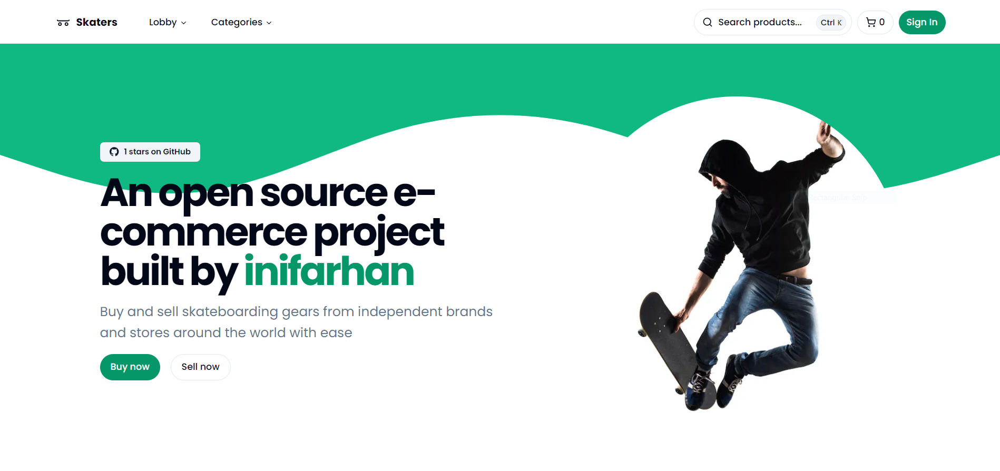

# [Skaters](https://skaters-inifarhan.vercel.app/)

This is an open source e-commerce project build by [Inifarhan](https://github.com/inifarhan) with everything new in Next.js 14.

[](https://skaters-inifarhan.vercel.app/)

> **Warning**
> This project is still in development and is not ready for production use.
>
> Please check the [roadmap](https://inifarhan.notion.site/972df2ba233849f692d0bcce51934d43?v=465be802f86740b99f8b4670174086df&pvs=4) of this project in notion

## Tech Stack 💻

- **Framework:** [Next.js](https://nextjs.org)
- **Styling:** [Tailwind CSS](https://tailwindcss.com)
- **Authentication:** [Next Auth](https://authjs.dev)
- **Database:** [Mysql](https://www.mysql.com)
- **ORM:** [Prisma ORM](https://www.prisma.io)
- **UI Components:** [shadcn/ui](https://ui.shadcn.com)
- **File Uploads:** [uploadthing](https://uploadthing.com)
- **Payments infrastructure:** [Midtrans](https://midtrans.com)

## Features to be implemented

Check the [roadmap](https://inifarhan.notion.site/972df2ba233849f692d0bcce51934d43?v=465be802f86740b99f8b4670174086df&pvs=4)

## Running Locally

1. Clone the repository

   ```bash
   git clone https://github.com/sadmann7/skateshop.git
   ```

2. Install dependencies using pnpm

   ```bash
   pnpm install
   ```

3. Copy the `.env.example` to `.env` and update the variables.

   ```bash
   cp .env.example .env
   ```

4. Start the development server

   ```bash
   pnpm run dev
   ```

5. Push the database schema

   ```bash
   pnpm run db:push
   ```

6. Start the Stripe webhook listener

   ```bash
   pnpm run stripe:listen
   ```

## How do I deploy this?

Follow the deployment guides for [Vercel](https://create.t3.gg/en/deployment/vercel), [Netlify](https://create.t3.gg/en/deployment/netlify) and [Docker](https://create.t3.gg/en/deployment/docker) for more information.

## Contributing

Contributions are welcome! Please open an issue if you have any questions or suggestions. Your contributions will be acknowledged. See the [contributing guide](./CONTRIBUTING.md) for more information.

## Contributors

Thanks goes to these wonderful people for their contributions:

<p align="center">
 <a href="https://github.com/sadmann7/skateshop/graphs/contributors">
   
 </a>
</p>

<p align="center">
 Made with <a rel="noopener noreferrer" target="_blank" href="https://contrib.rocks">contrib.rocks</a>
</p>

## License

Licensed under the MIT License. Check the [LICENSE](./LICENSE) file for details.
